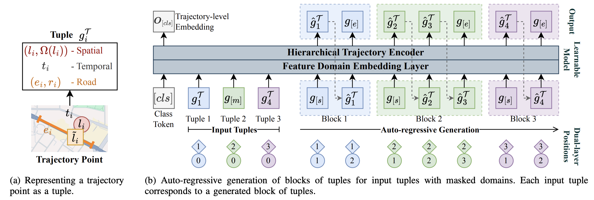

# UVTM: Universal Vehicle Trajectory Model

Implementation code of **Universal Vehicle Trajectory Model (UVTM)** proposed in TKDE 2025 paper *UVTM: Universal Vehicle Trajectory Modeling with ST Feature Domain Generation*.

## Model Overview

UVTM is a decoder-only structure, dividing trajectory features into spatial, temporal, and road domains. Each domain can be masked and generated independently to accommodate tasks with only partially available features.
Its design is inspired by the input-output formulation of *GLM: General Language Model Pretraining with Autoregressive Blank Infilling*, which enables generation of missing sub-trajectories with unknown lengths.

> Du, Zhengxiao, Yujie Qian, Xiao Liu, Ming Ding, Jiezhong Qiu, Zhilin Yang, and Jie Tang. “GLM: General Language Model Pretraining with Autoregressive Blank Infilling.” In Proceedings of the 60th Annual Meeting of the Association for Computational Linguistics (Volume 1: Long Papers), 320–35. Dublin, Ireland: Association for Computational Linguistics, 2022. https://doi.org/10.18653/v1/2022.acl-long.26.

## Code Walkthrough

This repository is an old piece of code which I also need sometime to go through, update, and clean up. Sorry for the inconvenience.

## Paper Information

Pre-print: https://arxiv.org/abs/2402.07232

If you have any further questions, feel free to contact me directly. My contact information is available on my homepage: https://www.yanlincs.com/